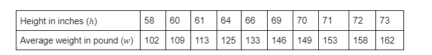
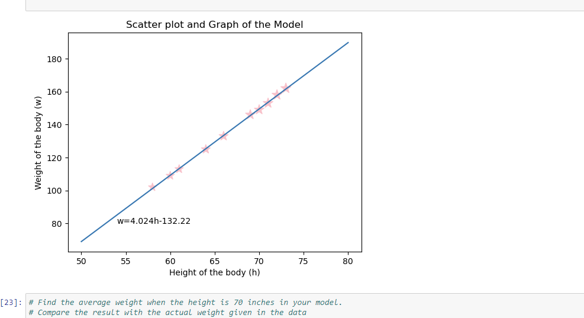

# Project-Python-Implementation-of-Linear-Regression-Line

This project is about According to Body Mass Index (BMI) The average weights of healthy bodies for the corresponding heights are given in the following table:

https://www.cancer.org/cancer/risk-prevention/diet-physical-activity/body-weight-and-cancer-risk/adult-bmi.html

The aim is to find a linear regression line for the relationship between height and weight, and a correlation coefficient for this relationship.

find a linear regression line for the relationship between height and weight and a correlation coefficient for this relationship, I  need to collect data on both variables from your sample population. So I used Python function to find the line of best fit in Jupyter. Use statistical software or a graphing calculator to calculate the equation of the line of best fit, which will represent the linear relationship between height and weight.

 Additionally, you can calculate the correlation coefficient, which will tell you the strength and direction of the relationship between the two variables. I suggest using Python's function to find the line of best fit in Jupyter, as it is a powerful tool for data analysis and visualization.

To create a graph of the model, plot the linear regression line on top of the scatter plot. This will allow you to see how well the line fits the data and visualize the relationship between height and weight, you can create a scatter plot with height on the x-axis and weight on the y-axis. The scatter plot will show you if there is a linear relationship between the two variables.

